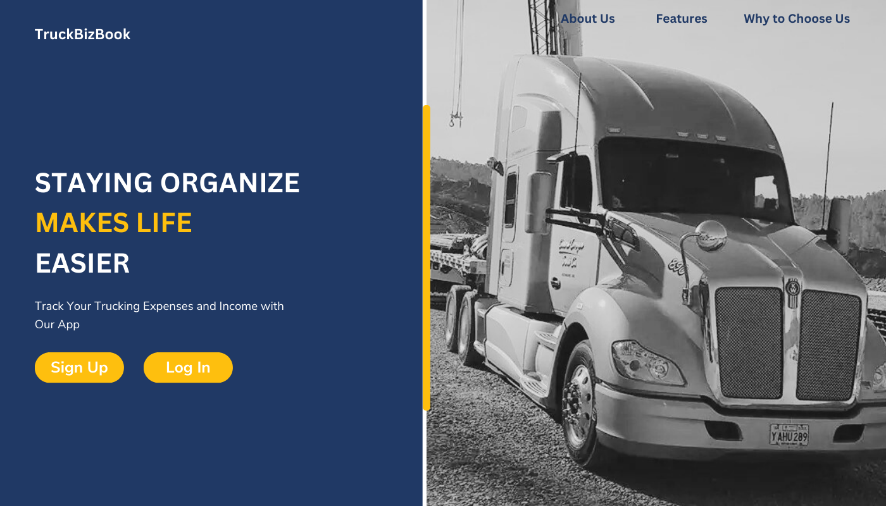
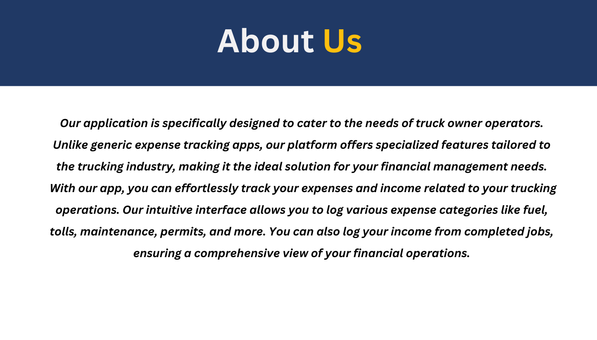
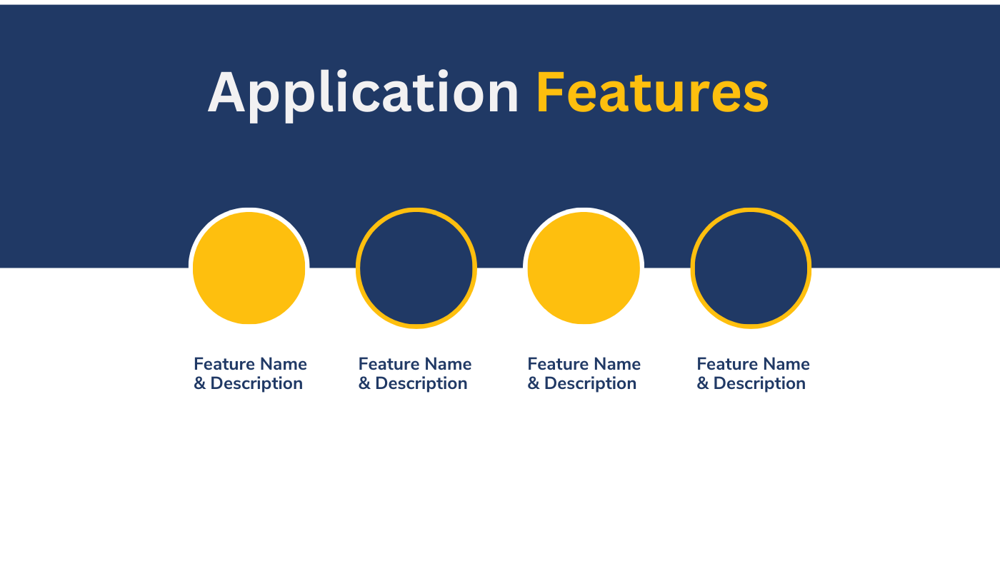
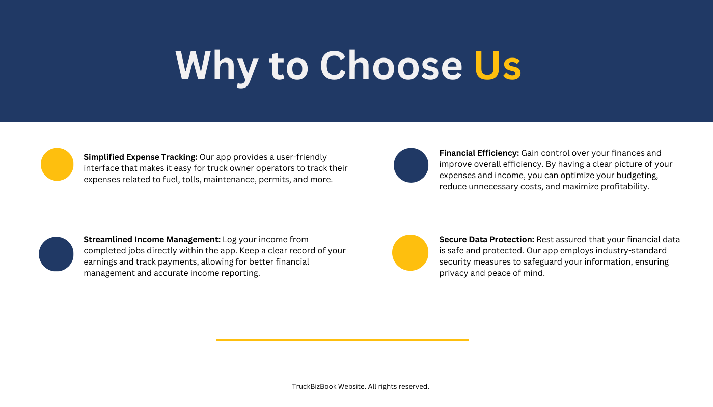
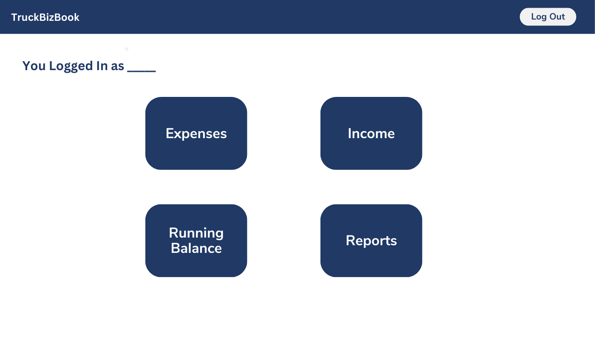
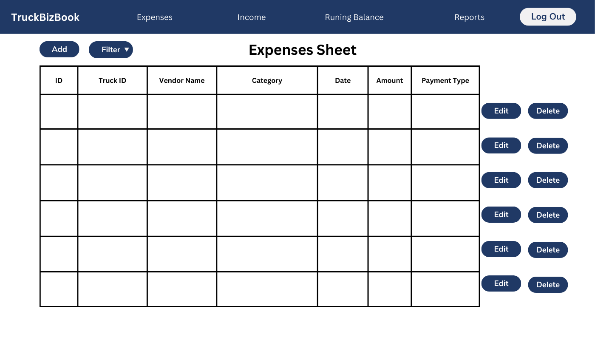
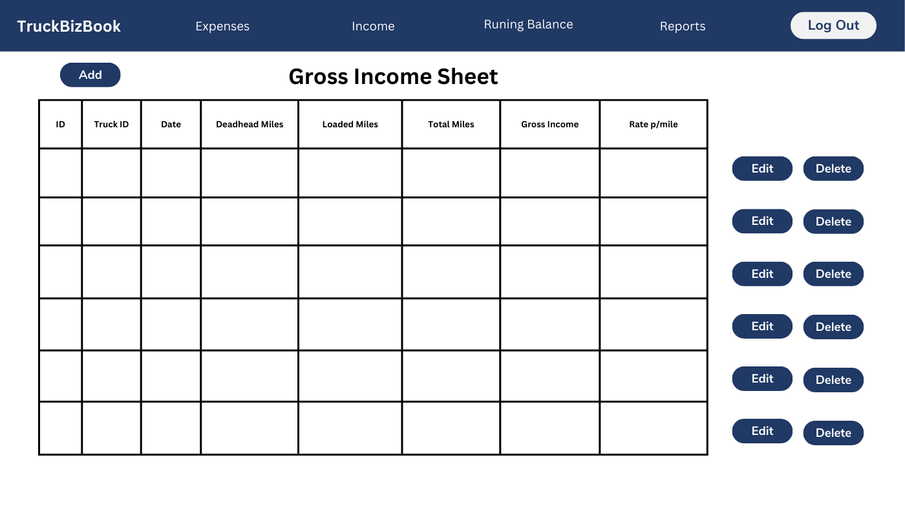
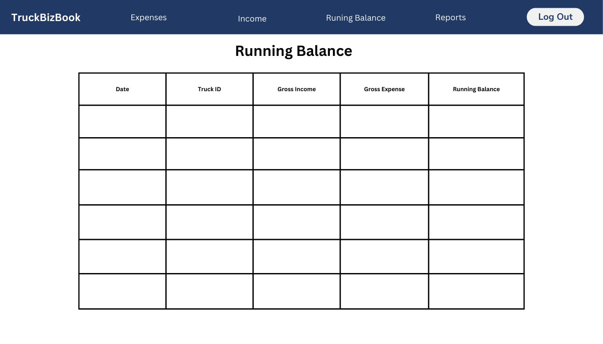
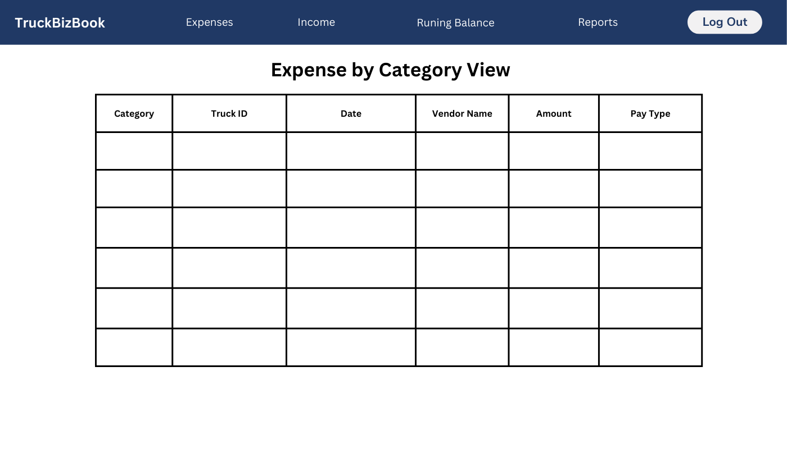

# Design Document

# TruckBizBook Design

## 1. Problem Statement

*Truck owner operators face challenges in effectively tracking their expenses and income, leading to difficulties 
in managing their financial operations. I would like to develop an application that helps truck owner operators track 
their expenses and income.  Users will be able to create new expense entries – like fuel, tolls, maintenance, permits, 
etc… They can also log their income from completed jobs. The application will provide reports to help monitor 
profitability and manage finances effectively.*

## 2. Top Questions to Resolve in Review

1. What data type to use for the date, shall I use a date picker (using a calendar)?
2. What if the owner operator has more than 1 truck? Shall I include it in my base functionality?
3. After logging in - what the application should display - the options the user can choose from - is the right option 
to go with?

## 3. Use Cases

* U1. As an owner operator I want to create a profile.
* U2. As an owner operator I want to update a profile if/when need it, so that I can maintain
accurate and up-to-date personal information.
* U3. As an owner operator I want to create operating expense entry, so that I can easily record my operating 
expenses, and it will enable me to track and manage my expenses effectively.
* U4. As an owner operator I want to update operating expense entry, so that I can modify and correct any inaccuracies
or changes in my operating expenses.
* U5. As an owner operator I want to view all operating expense, so that I can access a comprehensive list of my 
operating expenses to have a complete overview of my expenses, facilitating better financial analysis and 
decision-making.
* U6. As an owner operator I want to delete expense entry, so that I can remove specific expense entries
when necessary. It will allow me to manage my expense records accurately.
* U7. As an owner operator I want to create an entry of income, so that I can easily record my income transactions.
* U8. As an owner operator I want to delete an entry of income, so that I can remove specific income entries 
when necessary. It will allow me to manage my income records accurately.
* U9. As an owner operator I want to update an entry of income, so that I can modify and correct income entries 
as needed, it will enable me to keep my income records accurate and up to date.
* U10. As an owner operator I want to view all income entries, so that I can access a comprehensive list of my 
income entries.
* U11. As an owner operator I want to filter by category, so that I can easily sort and group entries based on specific
categories.
* U12. As an owner operator I want to see a graph representation of my expenses and income by month, so that
I can visualize my expenses and income trends over different months.
* U13. As an owner operator I want to generate report and export it in PDF format, so that I can generate a 
comprehensive financial report and save it in a portable format.

## 4. Project Scope

### 4.1. In Scope

1. As an owner operator I want to create a profile.
2. As an owner operator I want to update a profile.
3. As an owner operator I want to create operating expense entry;
4. As an owner operator  I want to update operating expense entry;
5. As an owner operator  I want to view all operating expense;
6. As an owner operator  I want to delete expense entry.
7. As an owner operator  I want to create an entry of income;
8. As an owner operator  I want to delete an entry of income;
9. As an owner operator  I want to update an entry of income;
10. As an owner operator I want to view all income entries;
11. As an owner operator  I want to filter by category;


### 4.2. Out of Scope

* Stretch Goal 1 - As an owner operator I want to see a graph representation of my expenses and income by month YTD;
* Stretch Goal 2 - As an owner operator I want to generate report and export it in PDF format.

# 5. Proposed Architecture Overview

The landing page for my application will provide a concise summary of its features and highlight its unique qualities 
compared to other available options in the market. Additionally, users will be presented with two button choices:
Sign Up and Log In. To authenticate users, I will use Cognito. For implementing the necessary CRUD functionality, 
I will utilize API Gateway and Lambda to create endpoints. The required information will be stored in DynamoDB database 
tables.

# 6. API

## 6.1. Public Models

**Profile Model**
- String companyName;
- String emailAddress;
- String firstName;
- String lastName;
- List<String> truckId;
- double startingBalance;

**Expense Model**
- String expenseId;
- String truckId;
- String vendorName;
- enum category;
- String date;
- double amount;
- enum paymentType;

**Income Model**
- String incomeId;
- String truckId;
- String date;
- double deadheadMiles;
- double loadedMiles;
- double totalMiles;
- double grossIncome; 
- double ratePerMile; (Gross income / Total Miles)

## 6.2. Create an operating expense-entry endpoint

#### POST/expenses/create
* Accepts data to create a new operating expense entry. Returns the new expense entry, including a unique ID assigned 
by the Trucking App Service.

## 6.3. Update an operating expense-entry endpoint
#### PUT/expenses/{id}
* Accepts data to update an operating expense. Returns the updated expense list.

## 6.4. View all operating expenses endpoint
#### GET/expenses/all
* Returns a list of ExpensesModels created by that user.
    * If the given user has not created any entries, an empty list will be returned

## 6.5. Delete an operating expense-entry endpoint
#### DELETE/expenses/{id}
* Accepts expenseId to be deleted from an expense list. Returns the updated expense list.

## 6.6. Create an income-entry endpoint
#### POST/incomes/create
* Accepts data to create a new income entry. Returns the new income entry, including a unique ID assigned
  by the Trucking App Service.

## 6.7. Update an income-entry endpoint
#### PUT/incomes/{id}
* Accepts data to update an income entry. Returns the updated income list.

## 6.8. View all income entries endpoint
#### GET/incomes/all
* Returns a list of IncomeModels created by that user.
    * If the given user has not created any entries, an empty list will be returned

## 6.9. Delete an income-entry endpoint
#### DELETE/incomes/{id}
* Accepts incomeId to be deleted from an income list. Returns the updated income list.

## 6.10. Filter expense by category endpoint
#### GET/expenses/filter
* Accepts category to be filtered by, returns the updated filtered list.


# 7. Tables

`ProfileTable`
``` 
companyName //  string
emailAddress // string, partition key
firstName // string
lastName // string
truckId // List <String> 
startingBalance // double

```

`OperatingExpenseTable`
``` 
expenseId // partition key, string
truckId // string 
vendorName // string
category // enum
date // String
amount // double 
payment type // enum 
```

`IncomeTable`
``` 
incomeId // partition key, string
truckId // string 
date // String
deadHeadMiles // double
loadedMiles // double
totalMiles // double
grossIncome // double
ratePerMile // double

```

`CategoryIndex`
``` 
category // partition key, enum
truckId // sort key, string
date //LocalDate
vendorName //string
amount //double
payment type/enum
```


# 8. Pages
## Landing Page





## Application Interface







